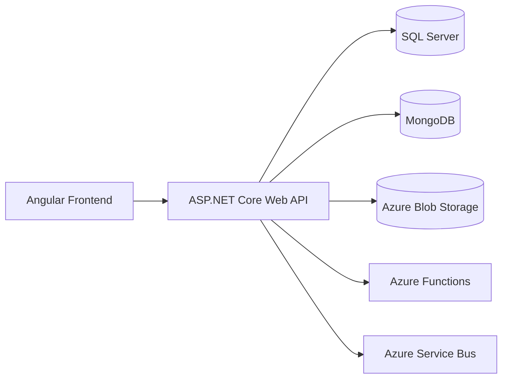

# Game Store

A full-stack demo application built with **ASP.NET Core Web API** and **Angular** (in progress), showcasing integration with multiple databases and cloud services.

---

## 🚀 Features
- **Backend**: ASP.NET Core Web API  
- **Databases**: SQL Server + MongoDB  
- **Cloud**: Azure Blob Storage, Azure Functions, Azure Service Bus  
- **Frontend**: Angular (basic version implemented, work in progress)  
- **Testing**: Unit tests + integration tests for critical components  

---

## 🛠️ Tech Stack
- **Backend**: .NET 8 / C#  
- **Frontend**: Angular 15 (basic UI for now)  
- **Databases**:  
  - SQL Server
  - MongoDB 
- **Cloud Services**:  
  - Azure Blob Storage  
  - Azure Functions 
  - Azure Service Bus 
- **Testing**: xUnit 

---

## 🏗️ Architecture

